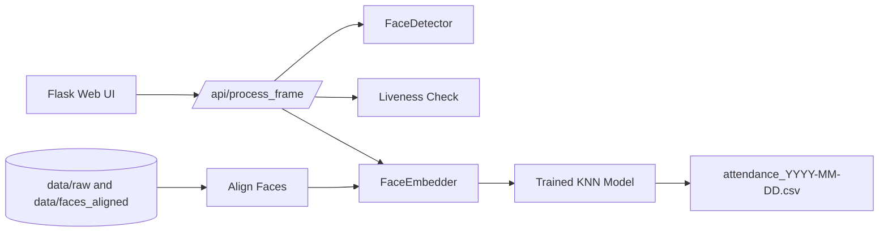

# AI Attendance System

## Problem
Build a classroom attendance system that identifies students by face and validates liveness to reduce spoofing.

## Approach
1. Collect face images, align them, and generate embeddings.
2. Train a KNN classifier with COA-based hyperparameter search.
3. Serve a Flask app for capture, liveness checks, recognition, and attendance export.

## Architecture diagram


## How to run
### 1) Install dependencies
```bash
python -m venv .venv
.venv\Scripts\activate
pip install -r requirements.txt
```

### 2) Prepare data and train
```bash
python main.py
```
Follow menu options 1-5 in the CLI.

Or run steps directly:
```bash
python -m src.data.data_capture
python -m src.data.detect_align
python -m src.model.embedder
python -m src.model.find_hyperparams
python -m src.train
```

### 3) Run the web app
```bash
python api/app.py
```
Open http://127.0.0.1:5000 in your browser.
